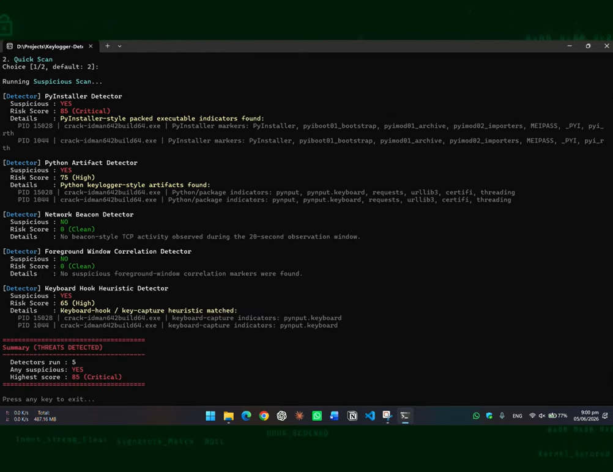
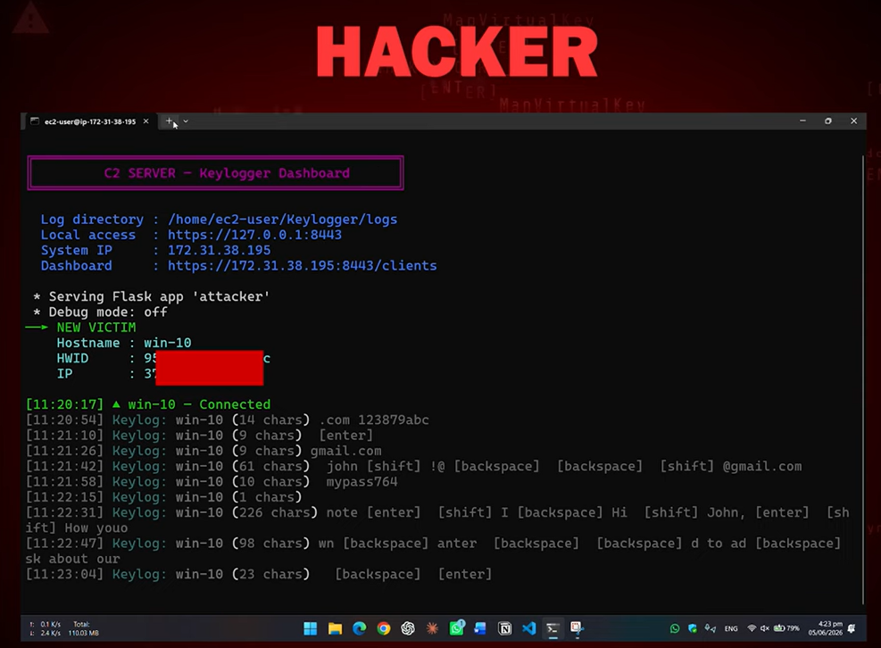

# Windows Keylogger Detector (Defensive Project)

<div align="center">
  
</div>

*Image showing keylogger detector*

> ## Disclaimer
> This is a defensive academic project created by M Ahmad Amin [@AhmadAmin5](https://github.com/AhmadAmin5) for an Information Security Course Lab at the [University of Engineering and Technology](https://uet.edu.pk) under the supervision of the lab instructor. It is intended only for defensive study, authorized system inspection, and controlled laboratory testing. Detection results are heuristic indicators—not proof that a process is malicious—and a clean result does not guarantee that a system is free from keyloggers or other threats.

This project is a C++20-based Windows security scanner that identifies indicators commonly associated with software keyloggers. It examines currently running processes, reads accessible executable images for suspicious ASCII and UTF-16LE markers, observes active IPv4 TCP connections, and correlates several behaviors into human-readable risk results.

The detector does not capture keystrokes, inject code, terminate processes, quarantine files, establish persistence, or send data over the network. It is a read-only console scanner intended for education and defensive analysis.

#### [Windows Keylogger](https://github.com/AhmadAmin5/Keylogger)

The keylogger detector is the defensive counterpart to the **[Windows Keylogger](https://github.com/AhmadAmin5/Keylogger)** project on my GitHub profile. Together, the two projects demonstrate how a threat may operate in an authorized lab and how defenders can engineer layered heuristics to investigate it.

<div align="center">
  
</div>

*Image showing keylogger attack (educational purpose)*


## Project Overview

The project implements a modular Windows detection workflow with:

- Five active detector modules registered through a common `IDetector` interface
- Windows process enumeration and executable-path discovery
- Static marker inspection of accessible running executables
- ASCII and UTF-16LE string matching
- A 20-second IPv4 TCP observation window
- Known-process filtering to reduce routine output
- Full and suspicious scan modes
- Per-detector suspicious verdicts, evidence, and risk scores
- A final summary based on the highest detector score
- Colored console output with an animated scan indicator

The scanner evaluates evidence from multiple perspectives rather than relying on a single filename or signature. Its results are designed to support investigation, not replace Microsoft Defender, EDR software, digital forensics, or professional incident response.

## Tech Stack

- **Primary language:** C++20
- **Target platform:** Microsoft Windows
- **Build system:** CMake 3.20 or newer
- **Windows APIs:** Tool Help, process-query, file I/O, and console APIs
- **Network inspection:** Windows IP Helper API and Winsock
- **System libraries:** `iphlpapi` and `ws2_32`
- **Supported toolchains:** Microsoft Visual C++ or MinGW-w64
- **Interface:** Interactive command-line application
- **Third-party library dependencies:** None

## Detection Modules

| Detector | What it inspects | Heuristic score |
| --- | --- | ---: |
| PyInstaller Detector | Embedded PyInstaller bootloader and packaging markers in running executable files | 85 |
| Python Artifact Detector | Python packages and keylogger-style strings such as `pynput`, `keyboard.Listener`, `on_press`, and `C2_URL` | 75 |
| Network Beacon Detector | Established or pending IPv4 TCP connections observed over 20 seconds, with attention to public destinations and selected high-risk ports | Up to 60 |
| Foreground Window Correlation Detector | The combined presence of foreground-window, window-title, and keyboard-polling API markers | 90 |
| Keyboard Hook Heuristic Detector | Keyboard-hook, key-state, and Python listener markers with weighted scoring | 65–95 |

These scores are rule-based severity values. They are not statistical confidence levels or proof of malicious intent.

## Getting Started

### Prerequisites

- Windows 10 or Windows 11
- Git
- CMake 3.20 or newer
- A C++20-compatible compiler
  - Visual Studio 2022 with **Desktop development with C++**, or
  - MinGW-w64
- Permission to inspect the target Windows system

Running the program as Administrator is recommended for better visibility into protected or elevated processes. The detector can still run without elevation, but Windows may prevent it from resolving or reading some executable paths.

### 1. Clone the Repository

```powershell
git clone https://github.com/AhmadAmin5/Keylogger-Detector.git
cd Keylogger-Detector
```

### 2. Build with Visual Studio

Open **Developer PowerShell for Visual Studio** in the project directory, then run:

```powershell
cmake -S . -B build
cmake --build build --config Release
```

Run the release executable:

```powershell
.\build\Release\app.exe
```

### 3. Build with MinGW-w64

```powershell
cmake -S . -B build -G "MinGW Makefiles" -DCMAKE_BUILD_TYPE=Release
cmake --build build
```

Run the executable:

```powershell
.\build\app.exe
```

The CMake configuration requests static GCC and standard-library linking when MinGW is used, helping the resulting executable run without separate MinGW runtime DLLs.

## Scan Modes

When the program starts, it asks the user to select a scan mode:

```text
1. Full scan       (shows all matching detector output)
2. Suspicious scan (shows filtered output, recommended)
```

Pressing Enter without a choice starts the recommended suspicious scan.

### 1. Full Scan

- Displays broader matching evidence from the active detectors
- May include results associated with known or commonly used applications
- Is useful for learning, debugging, and reviewing why a marker matched
- Does not list every process; it reports processes or connections relevant to a detector

### 2. Suspicious Scan

- Filters matches associated with the detector's built-in known-process lists
- Focuses the output on processes that are not excluded by name
- Reduces routine noise during normal defensive checks
- Is the default mode

The built-in process lists are convenience filters, not security boundaries. They use process-name matching and must not be interpreted as proof that a process is trustworthy.

## Main Features

### 1. Running Process Inspection

- Enumerates active processes with the Windows Tool Help API
- Collects process identifiers and executable names
- Uses limited process-query access to resolve executable paths
- Excludes the detector's own process from analysis
- Continues scanning when individual processes cannot be opened

### 2. Executable Marker Scanning

- Reads accessible executable images belonging to running processes
- Searches for markers in both ASCII and UTF-16LE representations
- Scans files up to 100 MiB
- Reports the PID, process name, and matched markers as evidence
- Does not alter the inspected executable

### 3. PyInstaller Identification

The PyInstaller module looks for packaging indicators such as `PyInstaller`, `MEIPASS`, `_PYI`, `pyiboot01_bootstrap`, and PyInstaller runtime-hook strings. These markers can help identify packaged Python applications, including the companion laboratory keylogger.

PyInstaller is also used by many legitimate applications. A PyInstaller match alone must therefore be investigated rather than treated as confirmation of a keylogger.

### 4. Python Keylogger-Style Artifact Detection

The Python artifact module searches running executable images for strings connected with Python input listeners, threading, HTTP communication, and the companion lab threat model. Examples include `pynput.keyboard`, `keyboard.Listener`, `on_press`, `requests`, `C2_URL`, and `verify=False`.

The module assigns a suspicious verdict only when matching evidence belongs to a process outside its built-in known-process exclusions.

### 5. Keyboard Hook Heuristics

The keyboard-hook module searches for Windows and Python indicators commonly associated with global keyboard monitoring, including:

- `SetWindowsHookEx`
- `WH_KEYBOARD_LL`
- `GetAsyncKeyState`
- `GetKeyState`
- `pynput.keyboard`
- `keyboard.Listener`

Matches receive different weights, and the detector reports the highest process-level score. These APIs also support legitimate hotkeys, accessibility tools, overlays, and input utilities, so context remains essential.

### 6. Foreground Window Correlation

This module requires evidence from all three of the following categories in the same running executable:

1. Foreground-window discovery through `GetForegroundWindow`
2. Window-title access through a `GetWindowText` marker
3. Keyboard polling through `GetAsyncKeyState` or `GetKeyState`

Requiring this combination produces a stronger behavioral indicator than treating any one API string as conclusive by itself.

### 7. Network Beacon Observation

- Samples the Windows IPv4 TCP connection table every 500 milliseconds
- Observes connections for approximately 20 seconds
- Reviews `ESTABLISHED` and `SYN_SENT` connections
- Associates connections with owning process IDs and process names
- Highlights public remote addresses, ports in the `8000–8999` range, and selected ports such as `4444`, `5555`, `6666`, `7777`, `9000`, `9001`, and `9999`
- Suppresses connections owned by known processes in suspicious mode
- Reports local and remote endpoints together with the TCP state

This module identifies beacon-style network indicators; it does not inspect packet contents or prove that a connection is command-and-control traffic.

### 8. Risk Reporting and Summary

Each detector returns:

- Detector name
- Suspicious status
- Risk score from 0 to 100
- Human-readable evidence or a clean-status message

The final summary reports the number of detectors run, whether any detector produced a suspicious result, and the highest individual risk score. Scores are not added together.

| Score | Label |
| ---: | --- |
| 0 | Clean |
| 1–25 | Low |
| 26–50 | Moderate |
| 51–75 | High |
| 76–100 | Critical |

## How the Detector Works

1. Initializes Windows console styling and displays the project banner.
2. Accepts the full or suspicious scan-mode selection.
3. Registers the five active detector modules.
4. Runs each detector on a background task while displaying a progress spinner.
5. Enumerates current processes or TCP connections according to the module.
6. Applies marker matching, correlation rules, known-process filtering, and risk scoring.
7. Prints detector-level verdicts and supporting evidence.
8. Produces a final system summary using the highest observed risk score.

## Educational Testing Workflow

1. Prepare an isolated and authorized Windows virtual machine.
2. Build the detector with a supported C++20 toolchain.
3. Run a suspicious scan on a clean baseline system and document normal results.
4. Use full scan mode to understand matches produced by legitimate software.
5. Generate synthetic, consent-based activity with the companion laboratory project.
6. Compare process markers, foreground-window correlation, and TCP evidence.
7. Validate alerts with trusted defensive tools such as Task Manager, Process Explorer, TCPView, Microsoft Defender, or an EDR platform.
8. Record false positives, false negatives, and opportunities for improving the heuristics.

Use synthetic input only. Never enter real passwords, private messages, financial details, or other sensitive information while testing monitoring-related software.

## Project Structure

```text
Keylogger-Detector/
├── .gitignore
├── CMakeLists.txt
├── include/
│   ├── core/
│   │   ├── console.hpp
│   │   ├── detection_result.hpp
│   │   ├── detector_registry.hpp
│   │   ├── i_detector.hpp
│   │   └── output_mode.hpp
│   ├── detectors/
│   │   ├── dummy_detector.hpp
│   │   ├── foreground_window_correlation_detector.hpp
│   │   ├── keyboard_hook_heuristic_detector.hpp
│   │   ├── network_beacon_detector.hpp
│   │   ├── pyinstaller_detector.hpp
│   │   ├── python_artifact_detector.hpp
│   │   └── windows_inspection.hpp
│   └── helper.hpp
└── src/
    ├── core/
    │   ├── console.cpp
    │   └── detector_registry.cpp
    ├── dummy_detector.cpp
    ├── foreground_window_correlation_detector.cpp
    ├── helper.cpp
    ├── keyboard_hook_heuristic_detector.cpp
    ├── main.cpp
    ├── network_beacon_detector.cpp
    ├── pyinstaller_detector.cpp
    ├── python_artifact_detector.cpp
    └── windows_inspection.cpp
```

`dummy_detector.cpp` provides a development placeholder but is not registered as one of the five active detectors in `main.cpp`.

## Extending the Project

The detector uses a small plugin-style architecture. To add another detection technique:

1. Create a class derived from `IDetector`.
2. Implement `name()` and `scan(OutputMode)`.
3. Return a `DetectionResult` containing a verdict, score, and evidence.
4. Register the detector in `main.cpp` through `DetectorRegistry`.

This design keeps process collection, output formatting, and individual detection ideas separated for easier academic experimentation.

## Privacy and Safety

- The program does not record or store keystrokes.
- It does not install hooks or monitor live keyboard input.
- It does not create outbound network connections.
- It does not upload process, file, or connection information.
- It does not modify, delete, terminate, or quarantine inspected items.
- Results are displayed in the console and are not written to a log file by the current code.
- Executable inspection is limited to readable files belonging to currently running processes.

## Known Limitations

- Static strings can appear in legitimate applications and cause false positives.
- Marker matching is literal and case-sensitive, and the presence of an API name does not prove that the API is actively being used.
- Obfuscation, encryption, runtime API resolution, custom packers, or removed strings may cause false negatives.
- Protected or elevated processes may be inaccessible without sufficient privileges.
- Executables larger than 100 MiB are skipped by the marker scanner.
- Only currently running processes are inspected; dormant files are not scanned.
- File markers are read from executable images on disk, not from process memory.
- The network module observes IPv4 TCP only; it does not analyze IPv6, UDP, DNS, TLS contents, or packet payloads.
- The 20-second network window can miss activity that occurs before or after the scan.
- Public TCP traffic or development ports can be legitimate and may trigger the network heuristic.
- Known-process filtering is based on filename substrings and can both hide relevant evidence and be imitated by a malicious filename.
- The scanner does not inspect kernel drivers, firmware, browser extensions, injected code, scheduled tasks, registry persistence, or every possible keylogging technique.
- No automatic remediation or continuous real-time protection is provided.

## Important Notes

- Run the detector only on systems you own or are explicitly authorized to inspect.
- Treat every result as an investigative lead rather than a final malware classification.
- Verify suspicious PIDs, executable paths, digital signatures, hashes, parent processes, and network destinations with trusted tools.
- A `SYSTEM CLEAN` summary means that the current heuristics found no reportable evidence during that scan; it is not a security guarantee.
- Administrator privileges may improve visibility but do not eliminate all inspection limitations.
- The network detector adds approximately 20 seconds to each complete scan.
- This project is an academic prototype, not a replacement for antivirus or EDR protection.

## Why This Project Is Useful

This project connects modern C++ development with Windows process inspection, executable analysis, TCP telemetry, heuristic scoring, and defensive security engineering. Its modular structure shows how several weak signals can be organized into explainable detection results while also demonstrating the importance of false-positive handling, validation, and honest security limitations.

Used together with the companion educational keylogger project, it provides a controlled way to study both a threat model and the defensive reasoning used to identify suspicious activity.